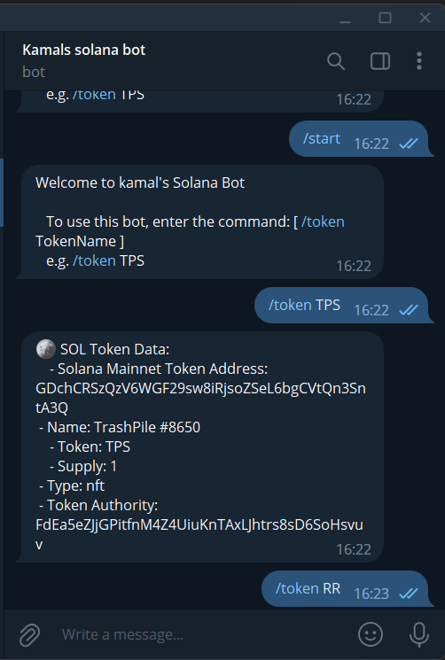

# Solana Token Bot with ZettaBlock API

## Introduction

 The Solana Token Bot is a program that allows you to interact with the Solana blockchain that fetches the token metadata live using the ZettaBlock API right in the telegram bot by just writing a simple command. 
 
 The ZettaBlock API is a set of APIs that allows developers to access and interact with the Solana blockchain.

## Installation

Clone the repository and install the dependencies.

```bash
git clone https://github.com/Zettablock/ethereum-token-metadata-bot.git
cd zettablock_token_bot
yarn install
```

## Config

Create a `.env` file in the root directory of the project. Copy the contents of `.env.example` into the `.env` file and fill in the values for the variables.

Example:
```
API_ID = 'YOUR_API_ID'
BOT_TOKEN = 'YOUR_BOT_TOKEN'
X_API_KEY = 'YOUR_X_API_KEY'
```

## Run

To start the bot, run the command below:

```bash
$ node bot.js
```

## How to use

Visit your bot on Telegram and type `/token $SYMBOL` to query the token metadata.


